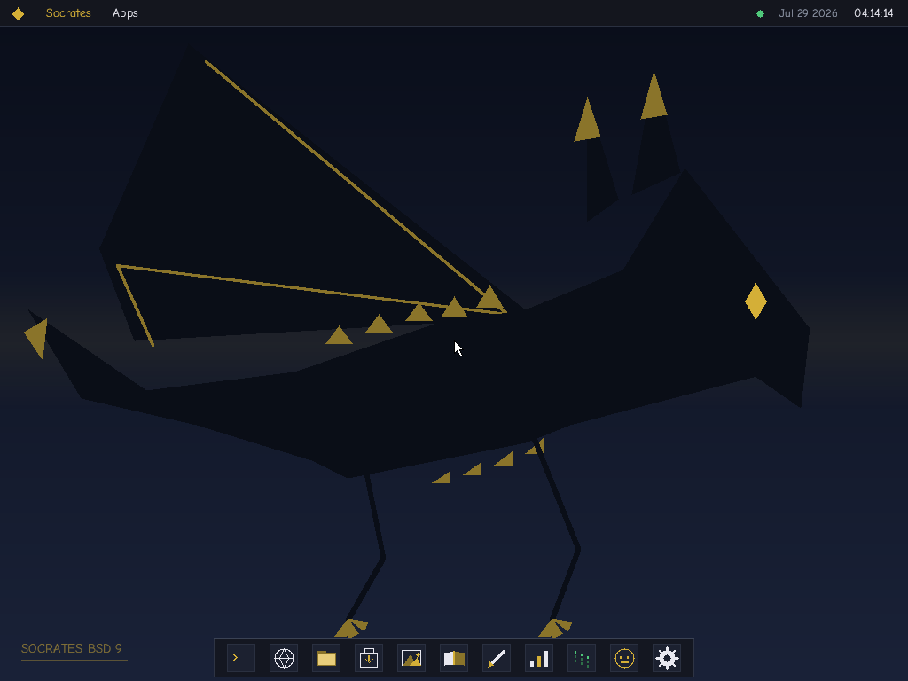

# Socrates BSD 9

A bare-metal x86_64 operating system built from scratch — custom kernel, TrueType font rasterizer, window manager, TCP/IP stack, web browser, boot animation and desktop UI, all without a libc or external OS dependencies.

---

## Features

### Desktop
- **Window manager** — z-ordered, click-to-focus windows with titlebar drag, close buttons, drop shadows and spawn animations
- **Menubar** — working Socrates / Apps menus (About, Restart, Shut Down, app launchers), live clock + date, network status indicator
- **Dock** — pictogram icons with hover tooltips, running indicators, bottom/left/right placement, adjustable size
- **Wallpaper themes** — five gradient themes with the dragon emblem, switchable live from Settings
- **Absolute pointer** — the cursor tracks the host's straight away, with no click-to-grab and no capture to escape from. A PS/2 mouse can only report *relative* motion, which a host cannot turn into a position without capturing the real cursor first, so the guest asks for the VMware backdoor pointer and falls back to PS/2 only when there is no hypervisor to ask
- **Scroll wheel** — negotiated through the IntelliMouse sample-rate knock, and routed to whichever window has focus: terminal scrollback, browser pages, store shelves, article lists
- **Resolution independent** — the desktop lays itself out around whatever mode the bootloader hands over, from 1024x768 up to 1920x1080

### Filesystem
- **Writable exFAT** on a real ATA disk (`disk.img`) — files survive reboots
- exFAT rather than FAT32 because **FAT32 caps a single file at 4 GB**; exFAT carries 64-bit sizes, so an offline archive of any size fits. The default volume is 8 GB and **sparse**, costing only the few megabytes actually used
- Full read/write driver: allocation-bitmap free space, contiguous (`NoFatChain`) *and* chained files, checksummed directory entry sets, free-form UTF-16 names — no more 8.3
- **`fs_read_range()`** reads a window out of a file, so nothing has to fit in a buffer. `peek <file> <offset> [n]` exposes it from the shell
- ATA PIO driver with **LBA48**, so volumes past 128 GB work; FAT32 and the ustar ramdisk remain as automatic fallbacks, and MBR partitions are probed, so a FAT32 boot partition can sit beside the exFAT system one
- One `fs_*` layer decides which filesystem is mounted; no app talks to a driver directly
- `disk.img` is a standard image: **mount it on your host** (macOS: `hdiutil attach -imagekey diskimage-class=CRawDiskImage disk.img`) to exchange files with the OS — including dropping in a multi-gigabyte archive
- Login keycode persists on disk (`keycode.sys`) — delete it to re-register
- A 16 KB read-ahead window and a cached FAT sector: small sequential reads used to cost one drive command per 512 bytes, and walking a fragmented file's cluster chain re-started from its first cluster on every call

### Terminal
- Crisp monospace grid rendering (8x8 bitmap font) with a blinking block cursor
- Command history (Up/Down), line editing (Left/Right/Home/End/Del), 240-line scrollback (PgUp/PgDn)
- Working directory (`cd` / `pwd`, shown in the prompt) and output redirection: `ls > list.txt`, `echo hi >> notes.txt`
- Commands: `help` `clear` `ls` `cat` `cd` `pwd` `rm` `mkdir` `cp` `df` `run` `echo` `date` `uptime` `mem` `mouse` `net` `arp` `ping` `dns` `fetch` `store` `img` `peek` `zim` `open` `history` `reboot` `shutdown`

### Networking
- **Full TCP/IP stack** — IPv4, ICMP (ping), UDP, DNS resolver, polled TCP client, async HTTP/1.0 client with redirects
- **Intel E1000 NIC driver** — PCI discovery, MMIO page mapping, RX/TX descriptor rings
- Works against real websites through QEMU user networking (`ping`, `dns`, `fetch`, and the browser)

### Browser
- Loads real `http://` pages over the in-kernel TCP stack (no TLS — bare metal has no secrets)
- HTML-to-text renderer: headings, paragraphs, lists, `<pre>`, entities, word wrap
- **Clickable links**, Back/Reload, editable address bar, scrollbar, status bar with load progress
- Internal pages: `socrates://home`, `socrates://help`, `socrates://about`, `socrates://file/<name>`
- Offline encyclopedia articles at `zim://<title>`, with internal links resolved back to archive entries

### App Store
- **Agora** — a working package manager with a storefront: browse a catalog, **Install**, **Open**, **Remove**
- Installing is a real operation — the payload is validated, copied to `/apps/<id>.bsd` on the system volume and recorded in the registry at `/apps/apps.db`, so **installed apps survive a reboot**
- Installed apps join the **dock** (after a separator, with their store icon) and the **Apps menu**, and launch straight into their own window
- Two package sources, one catalog:
  - the repository seeded on disk at `/store/pkg` (also carried in the initrd, so the storefront works on an ISO-only boot)
  - a **network repository fetched over the in-kernel TCP/IP stack** — `Refresh` pulls an index of `key:value` blocks, and each payload is downloaded with its own HTTP GET
- Every package is a **`.bsd` executable** (see below), validated field by field before a byte reaches the disk
- Ships five apps, all integer-only: **Mandelbrot** (16.16 fixed-point fractal), **Orbit** (five-body Newtonian integrator), **Game of Life** (149×100 torus over a heat map), **Plasma** (sine table built at runtime by a magic-circle oscillator) and **Voronoi** (28-site partition, network-only — it exists purely to exercise the download path)
- Also driveable from the shell: `store list` `store install <id>` `store remove <id>` `store run <id>` `store refresh` `store repo [url]`

### Apps
- **Files** — ramdisk explorer; double-click text files to view them in the browser
- **Goldsmith** — mouse paint app with palette, brush sizes and eraser
- **Monolith** — live system monitor (uptime, memory, pointer, TCP state, ARP cache)
- **Matrix** — falling glyph rain demo
- **hello** — userland ELF64 app rendering into its own window via `int 0x80` syscalls

### Graphics
- Portable base: the firmware (GOP/VESA) linear framebuffer — works on any GPU vendor, any VM
- **Intel Gen9/9.5 iGPU driver** (Skylake → Comet Lake): maps BAR0 GTTMMADR, programs a private GGTT window, brings up the BCS blitter ring in legacy submission mode, and executes `XY_COLOR_BLT` packets — with a CPU-verified self-test at boot
- Register/command encodings adapted from the Linux i915 driver; probe-then-bail structure after SerenityOS — display modesetting is deliberately left to firmware
- If no supported iGPU is present the OS silently stays on the CPU renderer (`gpu` in the terminal shows which path is live; `gpu test` blits to the visible framebuffer on real hardware)
- **GPU hang capture** (i915 error-state style): when a submission's breadcrumb never lands, the driver latches EIR/ESR, the per-engine IPEHR/IPEIR (the exact command header that broke the pipeline, decoded by name — e.g. a malformed `XY_COLOR_BLT`), ACTHD, INSTDONE, `RING_FAULT_REG` GGTT faults, the HWS page and the ring contents around the parse point — then attempts a `GDRST` blitter-domain engine reset, falling back to CPU rendering after repeated hangs. `gpu error` prints the full report; `gpu decode <hex>` decodes any command dword

### Wikipedia offline — the ZIM reader
Browse a complete offline encyclopedia on bare metal.

- **`src/zim.h`** — reads Kiwix ZIM archives straight off the exFAT volume, a window at a time. Nothing is loaded whole: only one decompressed cluster is held in memory, and consecutive articles usually share it
- Lookup is a **binary search over the archive's sorted path list** — about twenty reads across 400k entries, and only about twenty-five across a full dump's 19.7 million. It barely slows as the archive grows
- **`src/zstd.h`** — a complete Zstandard decompressor (FSE/tANS, Huffman, sequence reconstruction with repeat offsets), written from RFC 8878. ZIM has defaulted to zstd since 2021, so nothing opens without it. xz/LZMA2 clusters work too, via `lzma.h`
- **Wikipedia app** — type a title, get live prefix results with redirects marked; Enter or a click opens the article
- **Ask it questions** — the bubble in the header switches to a chat panel that retrieves an article and answers from it. The model loads by itself: drop a Qwen2 GGUF at `/qwen2.gguf` and it streams into memory in the background while the desktop stays live, with progress in the header. Nothing to type
- Articles render through the existing browser at `zim://<title>`, and **internal links are clickable**: relative hrefs, `../A/` namespace prefixes and percent-encoding are all resolved back to archive entries, so you can browse from article to article with Back working
- `zim open|info|main|ls|find|get` drive the same reader from the shell

Verified on a real 937 MB Simple English archive (399,853 entries, 3,711 clusters): lookups land on the same clusters and byte counts in the kernel as in a host-side reference run.

### Compressed images — the `.sci` format
Full-colour pictures stored compressed and decompressed when opened.

- **`src/lzma.h`** — a complete LZMA / LZMA2 / xz decompressor: range decoder, the full probability model, the LZMA2 chunk layer and enough of the xz container to walk its blocks. It decodes straight into the caller's buffer and uses that buffer as its dictionary window, so there is no separate 32 MB ring
- **`src/sci.h`** — the container. Each row gets a PNG-style prediction filter (None/Sub/Up/Average/Paeth, chosen per row by lowest absolute sum), and the filtered plane is one LZMA stream. Header carries dimensions, channels, filter mode, codec and both sizes, and is validated before anything is decoded
- **`tools/mkimg.py`** — PNG or PPM in, `.sci` out. It decodes PNG itself with Python's own `zlib`, so the build needs no Pillow and no opencv
- **Photos** — a gallery app: `.sci` files found in `/pics` and `/` down the left, the decoded picture on the right, click to toggle fit / 1:1. The status bar shows the real ratio. Double-clicking a `.sci` in Files opens it here, and `img <file>` works from the shell

The two shipped samples land at **623 KB → 12 KB (1%)** for the emblem and **450 KB → 241 KB (53%)** for a deliberately noisy interference field — the latter still smaller than its PNG.

### The `.bsd` executable format
A custom x86_64 container that every app store package uses, living in `bsdfmt/`.

- **`bsd_format.h`** — an 80-byte header: 4-byte magic `'B' 'S' 'D' 0x64`, a `uint32_t` version that pads the magic to 8 bytes so no `uint64_t` straddles an alignment boundary, then 64-bit entry point, text offset/size, data offset/size, load addresses, bss size and flags. `bsd_validate()` is a freestanding, overflow-safe checker shared verbatim by the host tools, the kernel loader and the store's download path
- **`bsd_maker.c`** — packs raw x86_64 machine code (`-t code.bin -d data.bin -b bss`), or repacks a linked ELF64's two `PT_LOAD` segments (`-e prog.elf`), which is how the store's packages are built
- **`bsd_run.c`** — POSIX loader: one anonymous `mmap()` for the image, copy the segments in, then `mprotect()` the text `PROT_READ|PROT_EXEC` and the data `PROT_READ|PROT_WRITE`. Neither is ever writable and executable at once, so **W^X holds** and the NX bit never fires on the entry jump. The entry address is cast to `long (*)(long)` and called
- Segments are page aligned and never share a page — otherwise `mprotect()`, which works at page granularity, could not give them different protections. `bsd_run` detects hosts with pages coarser than 4 KB (16 KB on Apple silicon) and refuses rather than silently mapping RWX
- Images carry no relocations, so a loader may place them anywhere as long as it preserves the text↔data distance

```sh
cd bsdfmt && make demo      # build the tools, pack two examples, run them
./bsd_run -n prog.bsd       # map and protect without calling (works on any host)
```

The kernel's loader (`src/desktop.h`) dispatches on magic: `.bsd` for store packages, ELF64 for `hello`, and it rejects anything else.

### Core
- **Custom TrueType rasterizer** — integer-only engine rendering Comic Neue (OFL) with 8x8 supersampled AA; no floats, no GPU. Baselines and glyph origins are snapped to whole pixels (left fractional, a 13px baseline lands on an exact half-pixel and fringes every letter), and each glyph's coverage mask is cached per size rather than re-rasterized on every frame — which is what makes the finer sampling affordable
- **Boot animation** — full-color video playback via raw RGB565 frames embedded at link time; any key skips it
- **Login screen** — first-boot keycode registration (persisted to disk) with melt animation on bad passwords
- **HAL** — IDT, PIT, PS/2 keyboard (incl. extended scancodes), PS/2 + VMware-backdoor pointer with wheel, ATA PIO, AC97 audio
- **Generic PCI layer** — full bus/device/function enumeration (multifunction aware), class-code lookup, BAR sizing incl. 64-bit BARs, shared page-table MMIO mapper
- **Syscall interface** — `int 0x80` gateway with a minimal userland ABI
- **Limine bootloader** — BIOS + UEFI dual-boot, El Torito ISO

---

## Demo

▶️ **[Watch the boot animation](boot.mp4)** — a full-color RGB565 video decoded and played by the kernel itself at boot (no GPU, no codec library).

> Sequence: boot animation → login screen → windowed desktop.

<!-- Screenshots: drop PNGs in docs/ and embed, e.g.  -->

---

## Requirements

| Tool | Notes |
|------|-------|
| `x86_64-elf-gcc` | Cross-compiler targeting bare-metal ELF |
| `x86_64-elf-ld` | Matching cross-linker |
| `xorriso` | ISO creation |
| `python3` + `opencv-python` + `numpy` | Boot animation conversion (only if `boot.mp4` changes) |
| `qemu-system-x86_64` | Running in a VM |

On macOS, install the cross-toolchain with Homebrew:

```sh
brew install x86_64-elf-gcc x86_64-elf-binutils xorriso qemu
pip3 install opencv-python numpy
```

---

## Build

```sh
make
```

This will:
1. Compile the kernel, the userland `hello` app, and the app store
   packages — each linked to ELF64 and then repacked into a `.bsd` image
   by `bsdfmt/bsd_maker`
2. Convert `boot.mp4` to raw RGB565 frames and embed them
3. Bundle the initrd (ustar tar) and assemble the bootable ISO at `os.iso`
4. Create `disk.img` — an 8 GB sparse exFAT system disk seeded with the
   starter files, the store's package repository under `/store/pkg` and
   the sample pictures under `/pics`. Override the size with
   `make DISK_MB=32768 cleandisk`

`disk.img` is created **once** and then left alone so your files survive
rebuilds. `make cleandisk` resets it to factory contents — **run this once
after pulling the app store** so the packages land on an existing disk.

---

## Run

```sh
make run
```

Launches in QEMU full-screen with E1000 networking and 2 GB of RAM.

Not every QEMU build ships the same display backends — Homebrew's macOS
build has Cocoa and no SDL — so `make run` asks the binary what it has and
picks one, printing the full-screen shortcut for that backend as it
starts (**Ctrl+Cmd+F** on macOS, **Ctrl+Alt+F** elsewhere).

**Just move the mouse** — the pointer is absolute, so there is no window
to click into first and no capture to break out of. Any key skips the
boot animation.

The mode is 1280x800 by default; override it per run, up to the
`BUF_MAX_W`/`BUF_MAX_H` back buffer in `src/kernel.c`:

```sh
make run RES=1920x1080x32
```

First boot asks you to choose a master keycode; it is saved to disk, so
subsequent boots only ask you to log in. Once on the desktop, try:

```
open browser            (or click the globe in the dock)
open store              (or click the shopping bag in the dock)
store install mandel    (then look at the dock, and `reboot`)
ping 10.0.2.2
fetch http://example.com
echo hello disk > hi.txt
mkdir projects && cp hi.txt projects/copy.txt
cat projects/copy.txt   (still there after `reboot`)
```

### Serving the network repository

The store's **Refresh** button queries an HTTP repository. To run one on
your host, in a second terminal:

```sh
make repo
```

That stages `build/repo/{index.sr, pkg/*.elf}` from the compiled packages
and serves it on port 8000. QEMU user networking maps the host to
`10.0.2.2`, which is exactly the store's default repository URL
(`http://10.0.2.2:8000/index.sr`), so **Refresh** just works — it picks up
`voronoi`, which is not on the disk, and installing it downloads the ELF
over the kernel's own TCP stack.

Point the store somewhere else with `store repo <url>` (saved to
`/apps/repo.cfg`). Package metadata lives in `apps/store/packages.txt`.

---

## Project Layout

```
src/            Kernel source
  kernel.c      Entry point, render loop, login flow, syscall stubs
  desktop.h     Window manager, menubar, dock, wallpaper, ELF loader
  term.h        Terminal (commands, history, scrollback)
  browser.h     Browser (HTML renderer, navigation, links)
  apps.h        Files / Settings / Photos / Wikipedia + RAG chat / About
  llm.h llm.c   Local transformer inference (the one SSE translation unit)
  store.h       Agora app store (catalog, installer, registry, storefront)
  lzma.h        LZMA / LZMA2 / xz decompressor (images + ZIM clusters)
  zstd.h        Zstandard decompressor (modern ZIM clusters)
  zim.h         ZIM archive reader (offline Wikipedia)
  sci.h         .sci compressed image format + decoder
  gfx.h         Theme palette + drawing primitives + monospace text
  netstack.h    IPv4 / ICMP / UDP / DNS / TCP / HTTP
  exfat.h       exFAT driver (read/write, 64-bit sizes, range reads)
  fat32.h       FAT32 driver (fallback)     ata.h  ATA PIO + LBA48
  pci.h         Generic PCI enumeration + BAR sizing + MMIO mapper
  igpu.h        Intel Gen9 iGPU blitter (GGTT + BCS ring + XY_COLOR_BLT)
  e1000.h       Intel NIC driver        ttf.h  TrueType rasterizer
  keyboard.h    PS/2 keyboard           mouse.h  pointer + wheel
  vmmouse.h     VMware backdoor protocol (absolute pointer, no grab)
apps/           Userland app source + seed files for the disk
  store/        App store packages + packages.txt (repository metadata)
  pics/         Sample PNGs, converted to .sci at build time
bsdfmt/         The .bsd executable format
  bsd_format.h  Header layout + shared validator
  bsd_maker.c   Builder (raw machine code, or repack an ELF64)
  bsd_run.c     POSIX loader: mmap + mprotect W^X + call
  bsd.ld        Linker script: page-separated text and data segments
tools/          mkexfat.py (exFAT formatter), mkfat32.py (FAT32),
                video converter,
                mkimg.py (PNG/PPM -> .sci), serve_repo.py (package repo),
                QEMU test driver (qemu_drive.py)
limine-binary/  Pre-built Limine bootloader binaries
Makefile        Top-level build system
```

---

## Download

Pre-built ISOs are available under [Releases](../../releases).

---

## License

Source code is released under the [Apache License 2.0](LICENSE).
Comic Neue font is licensed under the [SIL Open Font License 1.1](assets/OFL.txt).
Limine bootloader is [BSD 2-Clause](https://github.com/limine-bootloader/limine).
