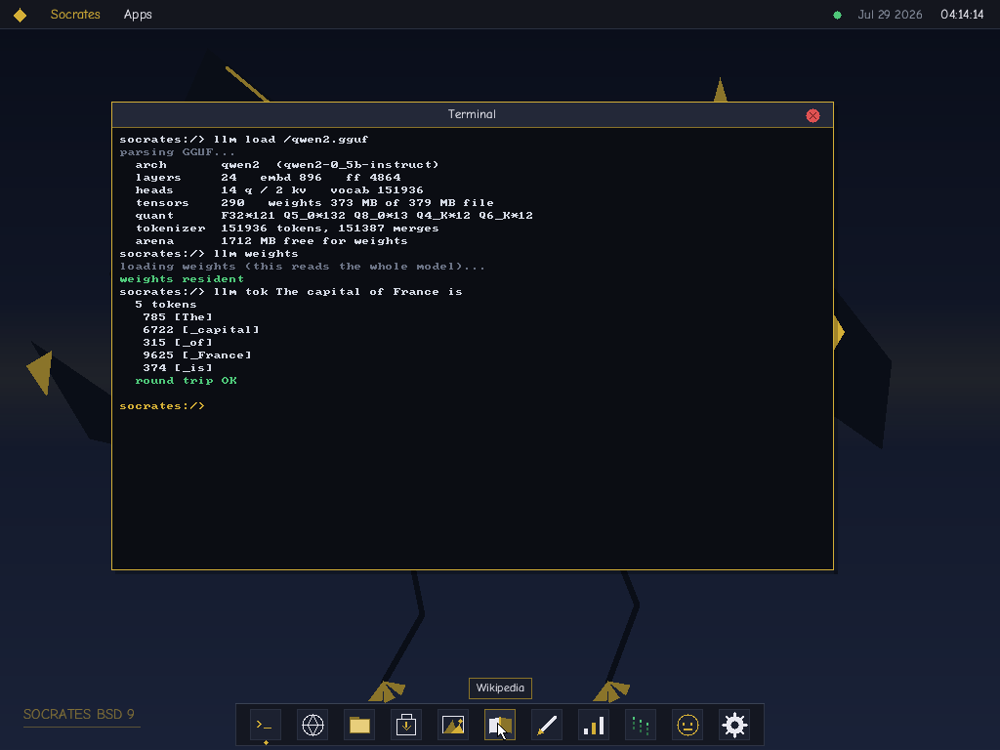
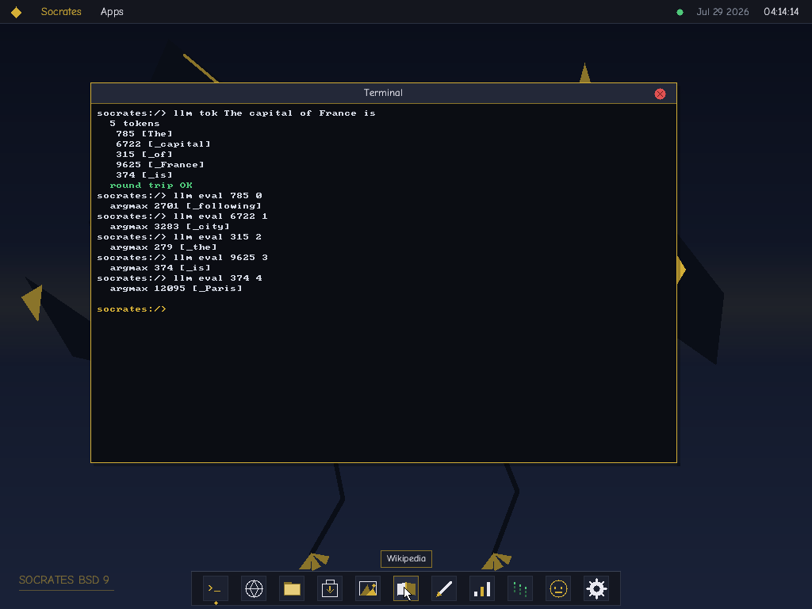
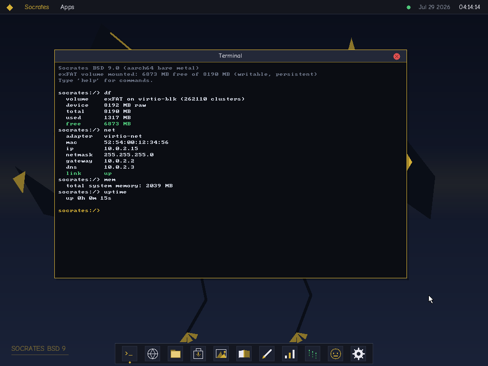
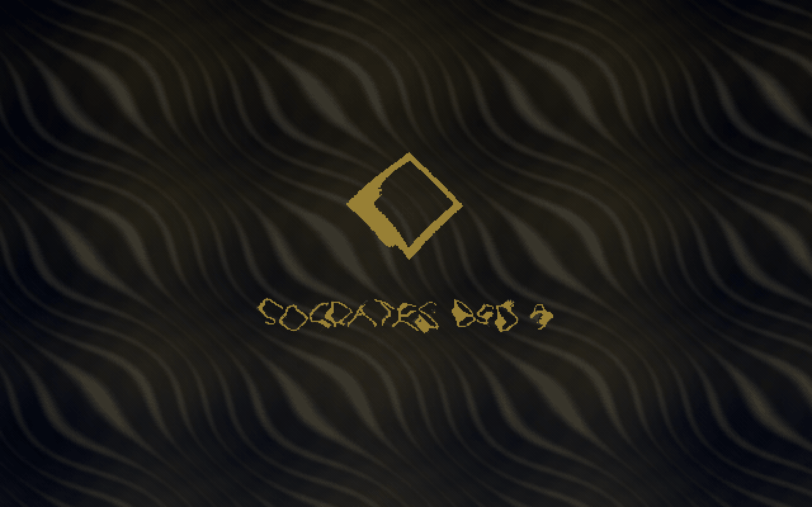

<h1 align="center">Vextro 9 — ARM64</h1>

<p align="center">
  <b>The same operating system, on a different architecture.</b><br>
  This page is about the <i>difference</i>.
</p>

<p align="center">
  
  
  
  
  <a href="../../releases"></a>
  <a href="https://github.com/mrcalmtuber/vextro"></a>
</p>

<p align="center">
  
</p>

> **What this OS actually *does*** — the windowed desktop, a browser on its
> own TCP/IP stack, offline Wikipedia, a transformer language model, an app
> store — is documented in the
> **[x86_64 repository](https://github.com/mrcalmtuber/vextro)**.
> All of it is here too, and all of it works. This page is about the
> machine layer underneath, because that is the only part that differs.

---

## Why port it at all

On an Apple silicon Mac, `qemu-system-x86_64` is a software emulator.
`qemu-system-aarch64` is not — it has `hvf`, and the guest's instructions
*are* the host's instructions.

That is not a marginal difference:

| Same measurement, each accelerator | tcg | hvf |
|---|---:|---:|
| Prompt evaluation to first token | 41,374 ms | **3,359 ms** |
| 397 MB of model weights resident | 1,079 ms | **426 ms** |
| Boot to kernel | ~200 s | **~5 s** |

It is the gap between a language model that answers at roughly a minute per
token and one that answers, and between a desktop that repaints three times
a second under load and one that holds a locked **60 fps**. The port is what
makes the ambitious parts of this project usable rather than merely
demonstrable.

Which is best shown by doing it. A 0.5B-parameter Qwen2 loaded off the
volume, its GGUF parsed, its five quantisation formats dequantised, and the
transformer run one token at a time — on a kernel with no libc:

<p align="center">
  
</p>

<p align="center">
  
</p>

Watch the prediction sharpen as context arrives — `The` → ` following`,
`The capital` → ` city`, `The capital of France` → ` is`, and then
**` Paris`**. That is the real forward pass, not a lookup: 24 layers, 14
query heads over 2 key/value heads, a 151,936-token vocabulary, and 373 MB
of weights resident.

And this is what the port was *for*:

<p align="center">
  
</p>

Asked *what is photosynthesis*, it took the distinctive words out of the
question, binary-searched 399,853 sorted titles, read
`[context: Photosynthesis]` off a 980 MB archive and answered from that
article — retrieval-augmented generation with no index, no database and no
network. The wording is the model's own, mangled grammar and all.

That is a complete answer, captured under `hvf`. **The same question on the
x86_64 tree, under full emulation, was still consuming the prompt five
minutes later** — which is the argument for this port in one screenshot.

<p align="center">
  
</p>

`df` and `net` above are the dispatch layers this port added: the same
filesystem and the same network stack, over virtio here and over a Pi's SD
card and GENET on hardware.

---

## What actually had to change

**Two thirds of the codebase came across untouched.** The compression,
filesystem, font, archive, browser and inference code was written
integer-only and reads every multi-byte value one byte at a time, so there
was not a single unaligned cast or endianness assumption to fix.

What had to be written was the machine layer — and a surprising amount of
*that* turned out to be deletion, because on this machine every device
speaks virtio.

| Concern | x86_64 | ARM64 |
|---|---|---|
| Boot | Limine, BIOS + UEFI | Limine, UEFI only, base revision 6 |
| Interrupts | 8259 PIC, 256-entry IDT | `VBAR_EL1`, 16 × 128-byte code slots |
| Timer | PIT 8254 + IRQ0 | Architected generic timer, **no interrupt at all** |
| Serial | COM1 @ 0x3F8 | PL011 |
| RTC | CMOS ports 0x70/0x71 | PL031 |
| Keyboard | PS/2 controller + ISR | virtio-input |
| Pointer | PS/2 + VMware backdoor for absolute | virtio-input tablet — **absolute natively** |
| Storage | ATA PIO / AHCI / NVMe | virtio-blk, or a Pi's SD card |
| Network | Intel e1000 | virtio-net, or a Pi 4's GENET |
| Display | Firmware framebuffer | **virtio-gpu, driven by the kernel** |
| Syscalls | `int $0x80` | `svc #0` |
| Reset / power off | PS/2 reset pulse, ACPI port pokes | PSCI `SYSTEM_RESET` / `SYSTEM_OFF` |
| GPU acceleration | Intel Gen9 blitter | dropped — no counterpart here |
| Audio | AC'97 | dropped |

`vmmouse.h` and the PS/2 packet-length negotiation are **deleted, not
ported**. The virtio tablet reports absolute positions natively, so there is
nothing to calibrate and no capture to escape from — an entire driver and
its protocol quirks stop being necessary.

Five virtio devices — keyboard, tablet, disk, network, GPU — share one
virtqueue implementation. That is why the PCIe ECAM window the port plan
budgeted for was never needed at all.

The whole port of `src/llm.c`, 1,399 lines of transformer maths, was **one
line**: a `sqrtss` instruction replaced by `__builtin_sqrtf`.

---

## The machine layer, piece by piece

### Exceptions are code, not descriptors

x86 has a table of 256 gate *descriptors*. aarch64 has one 2 KB-aligned
table of sixteen 128-byte slots holding **actual instructions**. There is no
`__attribute__((interrupt))` — GCC implements it only for x86 — so the
save/restore trampoline in `src/vectors.S` is written by hand: a 192-byte
frame covering x0–x30, `ELR_EL1` and `SPSR_EL1`.

The port plan called this its highest risk. It turned out to be the
opposite. Because the trampoline saves everything the AAPCS does not, the C
handler is reached by an ordinary `bl` and *is* ordinary C — the compiler's
x86 interrupt prologues needed no counterpart at all.

A system call is told apart from a fault by **reading a register**:
`ESR_EL1`'s exception class is `0x15` for SVC, rather than a whole vector
being dedicated to it.

### There are no I/O ports

The `inb`/`outb` pair that drove the PS/2 controller, the PIT, the CMOS and
PCI configuration space has no counterpart whatsoever. Every device is
memory-mapped and drivers read and write volatile pointers. Which sounds
simpler, and is — right up until the next section.

### Time comes from the CPU, not a chip

`CNTPCT_EL0` is a monotonic counter in a system register, with a frequency
the hardware reports in `CNTFRQ_EL0`. The render loop paces itself against
real elapsed time with **no interrupt controller, no vector and no
handler**. The x86 side needs the PIT and an ISR to do the same job, and its
tick count drifts whenever a frame runs long. This does not.

### Memory ordering stops being free

x86's store ordering was doing invisible work. The e1000 driver's
descriptor-then-doorbell sequences carry no barriers at all, because there
they cost nothing and are implied. Here every one needs a `dsb` — cheap to
add, genuinely nasty to debug if missed, because the symptom is a device
that works under `tcg` and fails under `hvf`.

The `.bsd` loader pays the same tax in a different currency: instruction and
data caches are not coherent, so freshly written code needs `dc cvau` then
`ic ivau` before anything can jump to it.

### `-mgeneral-regs-only`

The counterpart of the x86 build's `-mno-sse -mno-80387` pile, and a
stricter one: it bars the compiler from touching the FP/SIMD registers
*anywhere* in the kernel, so no handler can quietly acquire a floating-point
dependency. The inference translation unit is the single exception and is
built without it.

---

## Three bugs that were worth the whole port

### Limine maps no device memory

It hands over with the MMU on and its own tables installed, covering the
kernel, RAM and the framebuffer — and nothing else. A hardcoded
`*(volatile uint32_t *)0x09000000` for the UART is an unmapped access.

The failure does not look like what it is. The fault happens on the **first
UART write**, which is before `VBAR_EL1` has been set, because setting it
requires getting far enough to call `exceptions_init()`. So the CPU vectors
to address zero, executes whatever the firmware left there, and lands in a
fault loop with a garbage stack pointer. From outside: a machine that is
powered on, consuming CPU, and completely silent.

Whether it happened at all depended on the CPU model. `-cpu host` left those
addresses reachable and `-cpu cortex-a72` did not, so the same binary
printed six lines under one and nothing under the other.

The kernel now builds its own `TTBR0` before its first character of output.

### Normal memory is speculatable

Mapping RAM that is not there is not a harmless over-approximation.

The architecture guarantees that reading backed memory has no side effects —
which is precisely why the CPU is allowed to fetch from Normal memory
unasked. Map a range that is **not** backed and that guarantee is void: the
core eventually speculates into a physical address nothing answers for.

Under emulation this is invisible, because `tcg` does not speculate. On real
silicon under a hypervisor it is a stage-2 fault on an access with no
instruction syndrome to decode, and qemu's hvf backend aborts the process
outright:

```
Assertion failed: (isv), function hvf_vcpu_exec
```

It fires about half a second into any guest that is executing instructions,
never in one parked in `wfi`, and bears no relation to what the code was
doing — **because the access was never in the code**. Finding it needed a
spin-only kernel (`-DBAREMIN`) to establish that the fault belonged to this
project at all before a bisect could even begin.

The mapper now classifies each gigabyte from two sources: what the firmware
reports as backed, and what the device tree says holds registers. RAM is
Normal, devices are Device, and anything else is **not mapped** — so a stray
access takes an ordinary stage-1 fault that prints `ESR` and `FAR` and says
exactly where it came from.

### A device tree read carelessly gives plausible wrong answers

Three separate versions of the parser looked correct and were not.

**A child's properties are not its parent's.** Match a node and then take
the next `reg` you see, and the GIC's nested v2m frame overwrites the
distributor address with its own MSI window — so the kernel programs an MSI
window believing it is an interrupt controller.

**Cell counts are per-node.** `reg` widths come from the *parent's*
`#address-cells`: the 64-bit default on qemu `virt`, and **one cell** under
a Raspberry Pi's `soc`. Read a fixed eight bytes and you get the address
with the size welded onto the end of it.

**Bus addresses are not CPU addresses.** A Pi describes its peripherals at
`0x7e000000` because that is what the VideoCore sees; the ARM core reaches
the identical registers at `0xfe000000`. The `ranges` property is the
translation, and a Pi 4 has three such buses with different cell counts
each.

Lookups are by `compatible` alone, never by node name — a Pi's UART node is
`serial@7e201000` and its interrupt controller is
`interrupt-controller@40041000`, and neither string should have to appear in
a kernel.

```sh
make test
```

runs the parser **on the host**, against two real blobs: the
`bcm2711-rpi-4-b.dtb` the Raspberry Pi firmware ships, and one dumped from
qemu. Nineteen addresses, and the expected values are what `dtc` prints for
those nodes worked through `ranges` by hand — not this parser's own output
written down after the fact.

---

## Raspberry Pi

| | |
|---|---|
| **`src/mbox.h`** | The VideoCore property mailbox. A Pi is a VideoCore computer with an ARM core attached: the firmware owns the clocks, the power rails and the display. There is no register that sets the SD card clock — there is a *message asking for one* |
| **`src/pifb.h`** | A framebuffer straight from the firmware, eight tags in one message. The display path that needs no UEFI graphics protocol at all |
| **`src/emmc.h`** | The SD card, which on a Pi *is* the disk. SDHCI, polled, the full `CMD0`/`CMD8`/`ACMD41`/`CMD2`/`CMD3`/`CMD9`/`CMD7`/`ACMD6` bring-up, both CSD versions for capacity |
| **`src/genet.h`** | The Pi 4's on-SoC gigabit MAC. Descriptor rings in the controller's own SRAM, buffers in host memory with explicit cache maintenance — DMA here is not coherent the way x86's is |

They sit behind interfaces that already existed: `blk.h` dispatches storage
between virtio-blk and the SD card, `e1000.h` dispatches the network between
virtio-net and GENET. The two backends can never coexist — a Pi has no
virtio and `virt` has no GENET — so the choice is made once at boot.

One detail that would otherwise have looked like broken hardware: the
framebuffer is mapped **Normal Non-cacheable**, not Device. Device memory
here means `Device-nGnRnE` — no gathering, no reordering, no early
acknowledgement — which is exactly right for a control register and turns
every pixel into its own bus transaction the core waits on. Three quarters
of a million of them per frame. There was no MAIR index for Normal-NC, so
the kernel programs one itself, after checking the slot is genuinely unused.

### What is and is not tested

**None of the four drivers has run on a Raspberry Pi.** There is not one
here, and the source says so where it matters — including which values are
inference rather than specification.

What *is* verified is everything that decides whether they are reachable:
the tree parses, the addresses resolve to the right physical numbers, the
board is identified, and the memory map is built from what the firmware
reports rather than from constants. `DTB=1 tools/arm_run.py` turns ACPI off
so EDK2 publishes a device tree, and the kernel boots to the desktop through
the full discovery path under both `hvf` and `tcg`.

The gap worth naming: `genet.h` asserts a gigabit link rather than
negotiating one, because it has no MDIO and never talks to the PHY. On a Pi
4 the PHY negotiates by itself and the MAC-to-PHY link is fixed, so that is
right in the ordinary case — but against a 100 Mbit switch the two ends
would disagree, and the symptom would be a link that passes no traffic
rather than a slow one.

---

## First light, and the bug it uncovered

<p align="center">
  
</p>

The boot animation is computed rather than played back. The dragon off the
desktop wallpaper draws breath and sets fire to the screen: an advected
flame streaming from its mouth, and a separate burn front that ignites where
the jet lands and then eats outward on its own, ember rim ahead of cold
char. Integer throughout, on the 360-entry sine table, with no square root
anywhere in it.

`src/bootanim.h` is **byte-identical to the x86_64 tree's** — only the
presentation loop differs, because this one composes into `backbuf` and
paces on the architected counter rather than a programmed one-shot. It
replaced 18.5 MB of raw RGB565 frames and a 6.8 MB `.mp4`, and took the ISO
from 22 MB to **4.2 MB**.

Deleting those frames is what made this tree stop booting.

`app_region` asked the compiler for 2 MB alignment, because `mmio_map_init`
maps the window with a **single block descriptor** and a block descriptor's
output address has no low bits. But `aligned(2 MB)` on an object aligns the
whole `.bss` *section*, so the linker gave that segment a file offset of
`0x200000` — and Limine checks `p_offset` against the size of the file it is
loading:

```
PANIC: elf: p_offset + p_filesz exceeds file size
```

It had always been wrong. It had never mattered, because 18 MB of boot
animation padded the kernel past `0x200000` and the offset landed inside the
file by accident. The moment the animation became code instead of data, a
half-megabyte kernel had a segment beginning a megabyte and a half beyond
its own end.

The alignment is load-bearing and stays. It is taken by hand now, out of a
buffer twice the size, and taken on the **physical** address rather than the
virtual one — that is the one the descriptor holds. `.bss` occupies nothing
in the file, so the spare 2 MB costs nothing, and the section is left at page
alignment where it belongs: offset `0x2000` instead of `0x200000`.

---

## Running it

This needs an **`aarch64-elf` cross toolchain** — a bare-metal kernel
cannot be built with the compiler that targets your own operating system.
On macOS:

```sh
brew install aarch64-elf-gcc aarch64-elf-binutils xorriso qemu
```

On Linux, `xorriso` and `qemu-system-arm` are packaged; the toolchain
generally is not, and `gcc-aarch64-linux-gnu` is *not* a substitute — it
targets Linux rather than bare metal. `python3` builds the disk image, and
nothing else is needed: the boot animation is computed by the kernel
rather than decoded from a video. `make` names everything missing at once
rather than stopping at the first one.

```sh
make            # kernel + UEFI ISO + the writable volume
make run        # qemu, hvf by default
make test       # the device tree parser, on the host, against real blobs
```

Pre-built ISOs are under [**Releases**](../../releases).

Cloned on its own, with no x86_64 tree beside it, `make` offers to fetch
**Simple English Wikipedia** (~980 MB) and the **Qwen2 0.5B** model
(~380 MB) and writes them onto this tree's own volume, which is sized to
fit them. `ASSETS=0` skips it, `ASSETS=1` takes them without asking.
Beside the x86_64 checkout none of that happens — the encyclopedia and
the model are already on that volume.

```sh
python3 tools/arm_run.py 400 hvf     # headless: serial, plus a register
                                     #   dump if the guest goes quiet
DTB=1 python3 tools/arm_run.py 90    # with a real device tree
python3 tools/arm_shot.py 300        # capture a frame
python3 tools/arm_input_test.py 330  # drive real input through QMP
```

`make run` picks up `../Vextro 9/disk.img` if present — the same 8 GB
exFAT volume the x86_64 build uses, byte for byte, carrying `wiki.zim` and
the model. `DISK=` and `DISK_RO=off` override.

**Run both accelerators.** `hvf` is the point, but `tcg` enforces weaker
memory ordering than Apple silicon does, and catches the missing barriers
`hvf` would hide.

`arm_run.py` reads serial over a socket rather than `-serial file:`, because
a dying qemu never flushes a file chardev — and the lost tail is exactly
where execution stopped. When the guest goes quiet it asks the CPU for its
registers, which is what identified the hardest bug in this port.

<details>
<summary><b>Toolchain and display notes</b></summary>

```sh
brew install aarch64-elf-gcc aarch64-elf-binutils xorriso qemu
```

UEFI firmware comes from QEMU's own `edk2-aarch64-code.fd`, which the
Makefile looks for in the places Homebrew, Debian and Fedora each put it;
`make run FIRMWARE=/path/to/QEMU_EFI.fd` if yours is somewhere else. ARM
has no BIOS, so unlike the x86 build there is no El Torito BIOS image and
no boot-sector install — the ISO is UEFI-only.

The kernel drives virtio-gpu itself, so the resolution is whatever the
device reports rather than whatever the firmware's mode table contains:

```sh
qemu-system-aarch64 -M virt -device virtio-gpu-device,xres=1440,yres=900 ...
```

Verified at 1440x900 with no `ramfb` attached at all. Limine's framebuffer
remains a fallback, but EDK2's ramfb driver offers three modes topping out
at 1024x768 — and asking for more does not degrade to the next one, it drops
to 800x600.

`.bsd` images declare their architecture in the fourth magic byte — `0xAA`
here, `0x64` on x86_64 — so each kernel refuses the other's binaries at the
first check rather than executing them as instructions they are not.

</details>

---

## Where the ARM-specific code lives

```
src/
  arm.h         System registers, PL011, PL031, generic timer, the page
                tables, PSCI reset/power-off, board identification
  fdt.h         Flattened device tree: per-node cell counts, `ranges`
                translation, matching by `compatible`
  vectors.S     VBAR_EL1 table + the svc #0 save/restore trampoline
  virtio.h      virtio-mmio transport + split virtqueue, shared by all five
  vtinput.h     Keyboard + absolute tablet
  vtgpu.h       virtio-gpu scanout, driven by the kernel
  blk.h         Block layer: virtio-blk or the SD card, one sector view
  ata.h         virtio-blk behind the ATA name the filesystems call
  emmc.h        Raspberry Pi SD card (SDHCI, polled)
  e1000.h       Network dispatch behind the NIC name netstack.h calls
  genet.h       Broadcom GENET v5 — the Pi 4's gigabit MAC
  mbox.h        VideoCore property mailbox
  pifb.h        Firmware framebuffer, via the mailbox
  keyboard.h    Ring buffer + scancode tables (no ISR, no port I/O)
  bsdload.h     .bsd loader — executable window, I-cache maintenance
  igpu.h        Inert: no integrated GPU on this machine

  *_x86.h.ref   The x86_64 originals, kept alongside for comparison

tools/
  arm_run.py        Boot, serial over a socket, register dump on silence
  arm_shot.py       Capture a frame through QMP
  arm_input_test.py Drive real pointer and key events
  fdt_test.c        The parser, on the host, against real device trees
  testdata/         A Raspberry Pi 4's blob, and qemu's
```

Everything else — `desktop.h`, `browser.h`, `zim.h`, `zstd.h`, `llm.c`,
`exfat.h`, `ttf.h` — is the portable two thirds, and is described in the
[x86_64 repository](https://github.com/mrcalmtuber/vextro).

**[PORT_STATUS.md](PORT_STATUS.md)** is the blow-by-blow: every milestone,
what each one cost, and what the original plan got wrong.

---

## Status

| | Milestone | Verified by |
|---|---|---|
| M0 | Toolchain, UEFI ISO, first pixel | boots and paints |
| M1 | Console, exceptions, timer, render loop | 60 fps, locked |
| M2 | Keyboard + absolute pointer | host `(0.75, 0.70)` arrives as `599,419` |
| M3 | virtio-blk + exFAT | 8 GB volume mounts; real root listing |
| M4 | virtio-net + TCP/IP + browser | ICMP 4/4; `HTTP 200`, page renders |
| M5 | aarch64 `.bsd` + `svc #0` | app runs; the x86_64 image is refused |
| M6 | Model + offline Wikipedia | ZIM v6, 399,853 entries; the model answers |
| M7 | Device tree + Raspberry Pi | 19 parser checks against real blobs; drivers written, **not run on a Pi** |

---

## The desktop this carries

The system layer is shared with the x86_64 tree and documented there. It
is worth saying what arrived in this port alongside the machine work,
because it is what you actually see when it boots:

A window manager with minimize, maximize, snap-to-edge and shake-to-clear;
Aero Peek, which fades the window stack towards the wallpaper when the
pointer reaches the taskbar; live window previews captured out of the
compositor; jump lists of recent items; desktop gadgets for the clock, the
system and the network; start-menu search across applications, recent
items and the volume; an Action Center; a calculator with no floating
point anywhere in it; and idle screen dimming.

One thing is wired differently here than on x86_64, because the loop is.
The System gadget's CPU meter measures the share of each frame the machine
could not spend waiting — on x86 the frame ends in `hlt` and the wait is
an interrupt, while here it ends in `timer_wait_until`, so the measurement
brackets that call instead.

---

## What is not here

No 3D graphics API — the framebuffer path is 2D only. No video or audio
codecs. No hypervisor, so no virtualised legacy environment. No TLS, so
`https://` is refused rather than faked. No disk encryption, no
application sandboxing: `.bsd` applications run with full kernel
privileges in a shared address space, so the account system buys identity
and separate workspaces and is **not** a security boundary. No
anti-malware, no device management, no biometrics, no multi-touch, no TV
tuner, no media streaming.

---

## The honest cost of a standalone copy

14,710 shared lines will drift. A bug fixed in `zstd.h` or `browser.h` has
to be fixed twice, by hand. That is the price of the independence this
repository was asked for, and it is real — but the architecture-specific 9%
is where nearly all future work happens, so the drift is mostly in stable
code.

---

## License

Source released under the [Apache License 2.0](LICENSE).
Comic Neue is under the [SIL Open Font License 1.1](assets/OFL.txt).
Limine is [BSD 2-Clause](https://github.com/limine-bootloader/limine).
